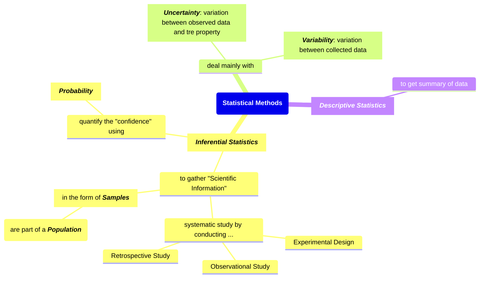
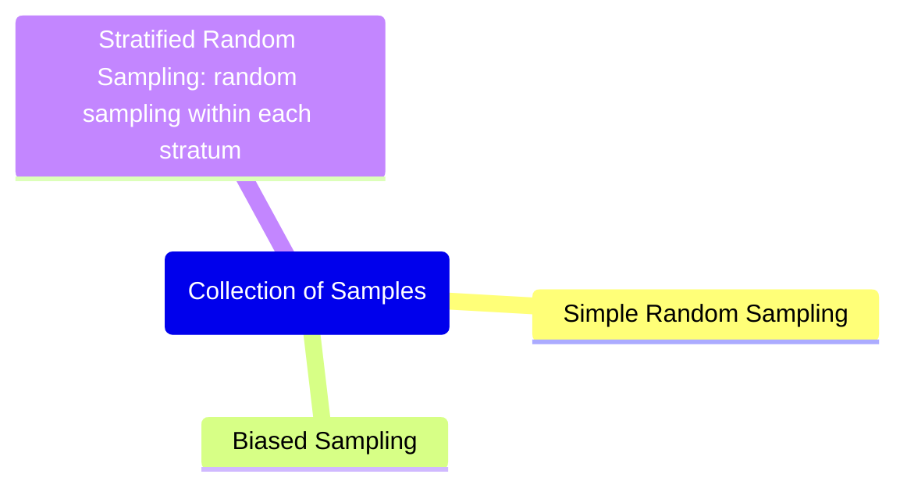
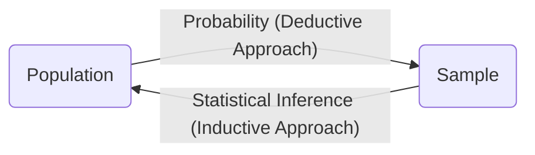
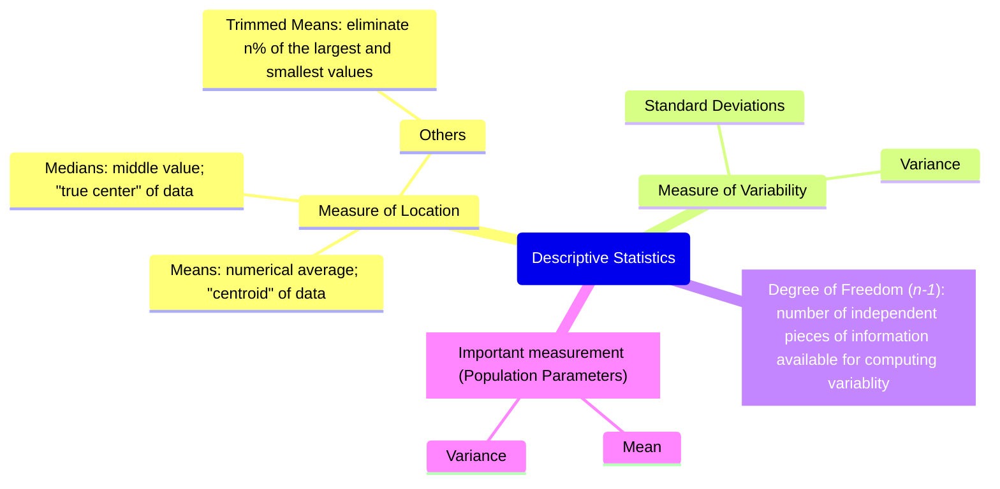
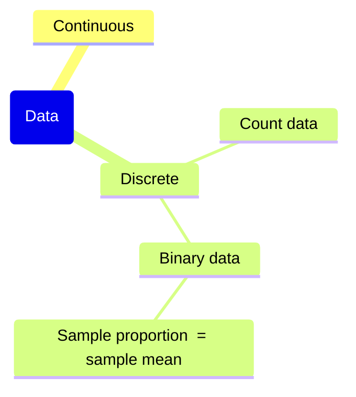

# Ch. 1 : Introductions to Statistics and Data Analysis

## Statistical Inference, Samples, Populations, and the Role of Probability

## Collection of Samples

### Role of Probability in Inferential Statistics

## Descriptive Statistics

## Discrete and Continuous Data

## Statistical Modeling, Scientific Inspection, and Graphical Diagnostics
- End result of statistical analysis: **estimation of parameters of a postulated model**
- Make a model based on assumptions on population data
    - Distribution of data is normal/Gaussian
    - etc
- Need characterize the nature of a data
    - Insight from graphical diagnostic -> help highlighting violation of assumptions
    - Do _Exploratory Data Analysis_ (EDA)
- Graphical data
    - Scatter Plot
    - Stem-and-Leaf Plot -> allow to see the distribution of data (alt: _Frequency Distribution_)
    - Histogram -> allow to see the distribution of data
    - Box-and-Whisker Plot or Box Plot -> visibility of median, quartiles, outliers, and tails of distribution
    - Density Plot
    - etc
    - 
