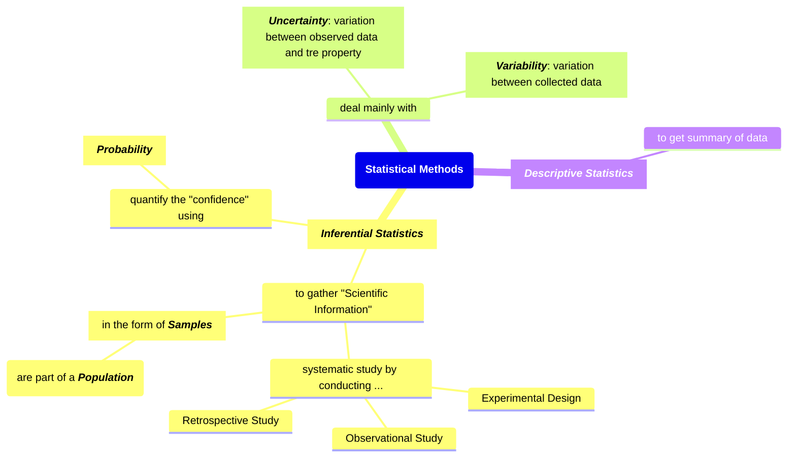
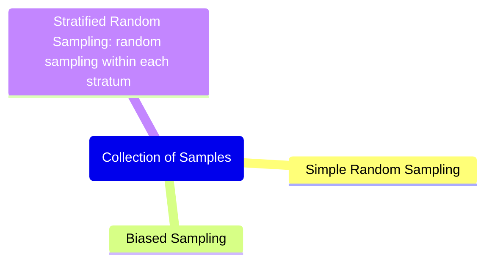
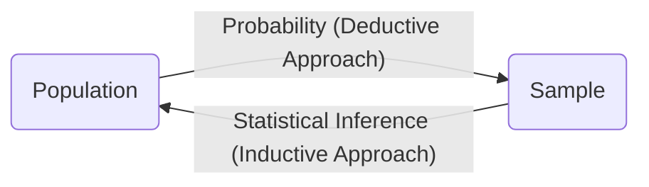
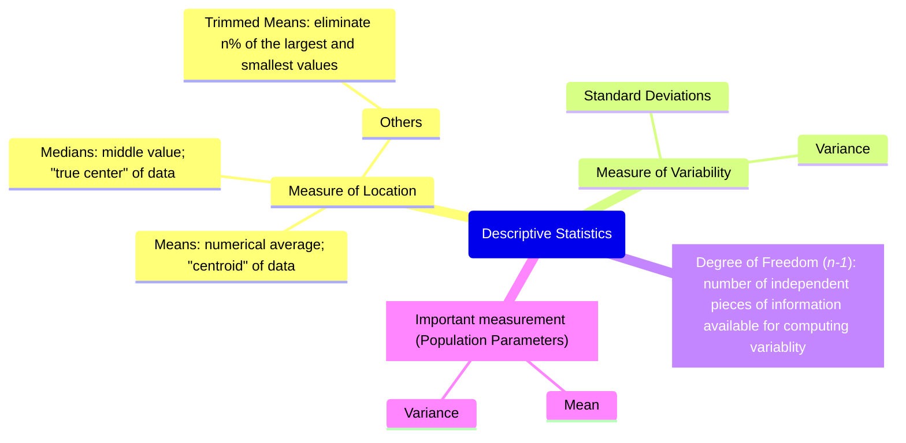
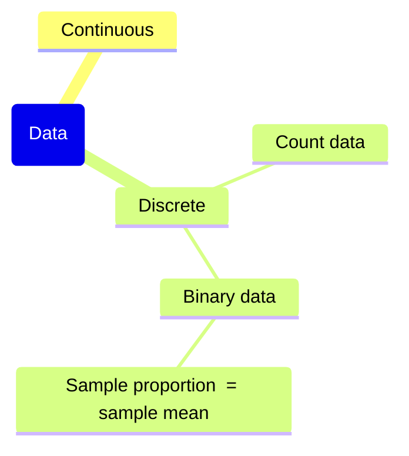
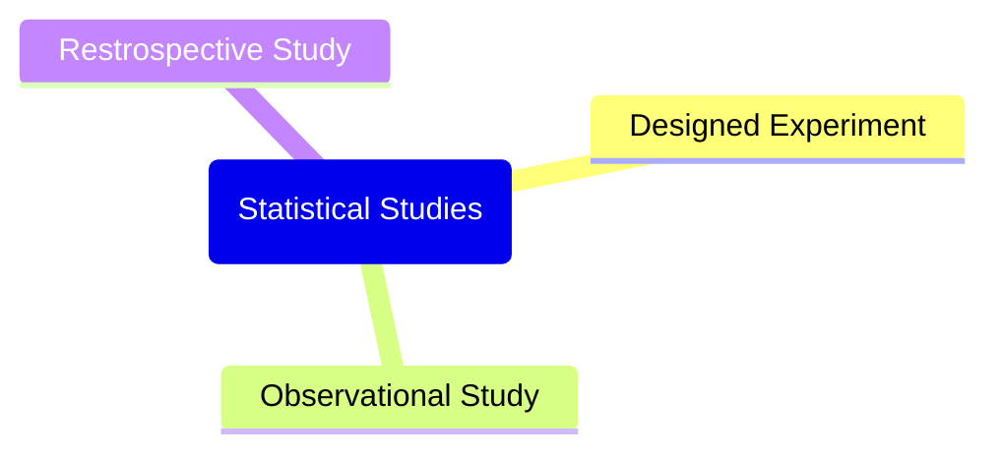

# Ch. 1 : Introductions to Statistics and Data Analysis

- [Ch. 1 : Introductions to Statistics and Data Analysis](#ch-1--introductions-to-statistics-and-data-analysis)
  - [Statistical Inference, Samples, Populations, and the Role of Probability](#statistical-inference-samples-populations-and-the-role-of-probability)
  - [Collection of Samples](#collection-of-samples)
    - [Role of Probability in Inferential Statistics](#role-of-probability-in-inferential-statistics)
  - [Descriptive Statistics](#descriptive-statistics)
  - [Discrete and Continuous Data](#discrete-and-continuous-data)
  - [Statistical Modeling, Scientific Inspection, and Graphical Diagnostics](#statistical-modeling-scientific-inspection-and-graphical-diagnostics)
  - [General Type of Statistical Studies](#general-type-of-statistical-studies)

## Statistical Inference, Samples, Populations, and the Role of Probability

## Collection of Samples

### Role of Probability in Inferential Statistics

## Descriptive Statistics

## Discrete and Continuous Data

## Statistical Modeling, Scientific Inspection, and Graphical Diagnostics

- End result of statistical analysis: **estimation of parameters of a postulated model**
- Make a model based on assumptions on population data
    - Distribution of data is normal/Gaussian
    - etc
- Need characterize the nature of a data
    - Insight from graphical diagnostic -> help highlighting violation of assumptions
    - Do _Exploratory Data Analysis_ (EDA)
- Graphical data
    - [Scatter Plot](https://en.wikipedia.org/wiki/Scatter_plot)

    

    - [Stem-and-Leaf Plot](https://en.wikipedia.org/wiki/Stem-and-leaf_display) -> allow to see the distribution of data (alt: _Frequency Distribution_)

    

    - [Histogram](https://en.wikipedia.org/wiki/Histogram) -> allow to see the distribution of data

    

    - [Box-and-Whisker Plot or Box Plot](https://en.wikipedia.org/wiki/Box_plot) -> visibility of median, quartiles, outliers, and tails of distribution
  
    

    - [Density Plot](https://www.geeksforgeeks.org/density-plots-with-pandas-in-python/)

    

    - [Violin Plot](https://en.wikipedia.org/wiki/Violin_plot)

    

    - etc

## General Type of Statistical Studies

- Interaction
  - When studying a simple experiment with two factors, we need to know whether the factors are interacting or not
  - Parallelism happened when the two factors are not interacting, producing parallel line when connecting the sample means