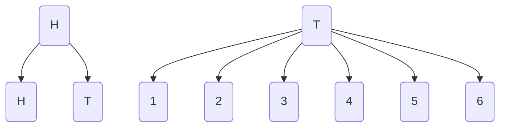
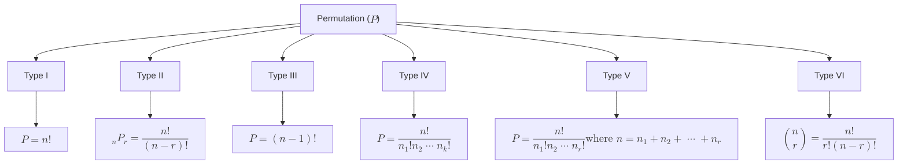

# Ch. 2: Probability

- [Ch. 2: Probability](#ch-2-probability)
  - [Sample Space](#sample-space)
  - [Events](#events)
  - [Counting Sample Points](#counting-sample-points)
  - [Probability of an Event](#probability-of-an-event)
  - [Additive Rule](#additive-rule)
  - [Conditional Probability](#conditional-probability)
  - [Bayes' Rule](#bayes-rule)

## Sample Space

- Experiment: any process that generates a set of data
- Sample space ($S$): a set of all possible outcomes of a statistical experiment
  - Element: each outcome in a sample space
  - In a coin tossing experiment, here is the sample space

```math
S = \left\{ H, T \right\}
```

  - In an experiment consists of flipping a coin and if a head occurs, the coin is flipped again and if a tail occurs, a die is tossed, the sample space is
  
```math
S = \left\{ HH, HT, T1, T2, T3, T4, T5, T6 \right\}
```

it also can be expressed in a tree diagram.



  - Sample space can also be expressed by a *statement* or *rule method*.
    
```math
S = \left\{ x | x \text{ is a city in Indonesia} \right\}
```

```math
S = \left\{(x, y) | x^{2} + y^{2} \leq 4 \right\}
```

## Events

- Event: subset of a sample space
- Complement 
  - A complement of an event $A$ ($A'$): subset of all elements of $S$ that are not in $A$
- Intersection
  - Intersection of event $A$ and $B$ ($A \cap B$): events containing all elements common to $A$ and $B$
  - If $A$ and $B$ are **mutually disjoint** (having no common element): $A \cap B = \phi$
- Union
  - Union of event $A$ and $B$ ($A \cup B$): events containing all elements that belong to $A$ and $B$ or both
- [Venn diagram](https://en.wikipedia.org/wiki/Venn_diagram) is used to illustrate the relationship between events


## Counting Sample Points

- Multiplication rule
  - If a person tossed a coin and a dice together, the total number of sample point:

```math
n_{\text{coin}} . n_{\text{dice}} = 2 \times 6 = 12
```

  - A sequence of $k$ operations can be operated in $n_{1} n_{2} n_{3} n_{\cdots} n_{k}$

- Permutation: arrangement of all or part of a set of object



  - Type I: number of permutation of $n$ objects 
    - Example: possible arrangements of letter *a*, *b*, *c*
    
```math
P = n!
```

  - Type II: number of permutation of $n$ distinct objects taken $r$ at a time
    - Example: ways to give three awards from 25 students

```math
_{n}P_{r} = \frac{n!}{\left( n-r \right)!}
```

  - Type III: number of permutations of $n$ objects arranged in a circle
    - Example: ways of arranging seat in a car

```math
P = \left( n-1 \right)!
```

  - Type IV: number of distinct permutations of $n$ things of which $n_{1}$ are of one kind, $n_{2}$ are of a second kind, $\cdots$, $n_{k}$ of a $k$th kind
    - Example: ways of arranging $xxxyy$

```math
P = \frac{n!}{n_{1}!n_{2} \cdots n_{k}!}
```

  - Type V: number of ways of partitioning a set of objects into $r$ cells with $n_{1}$ elements in the first cell, $n_{2}$ elements in the second cell, and so forth
    - Example: ways of arranging 7 people in 1 triple and 2 double hotel rooms
    
```math
P = \frac{n!}{n_{1}!n_{2} \cdots n_{r}!}
\newline
\text{where } n = n_{1} + n_{2} + \cdots + n_{r}
```

  - Type VI: combination of $n$ distinct objects taken $r$ at a time
    - Example: ways of taking 3 balls from a sack of 5 balls
  
```math
\binom{n}{r} = \frac{n!}{r! \left( n-r \right)!}
```

## Probability of an Event

- Probability of an event $A$

```math
0 \leq P(A) \leq 1, \hspace{1em} P(\phi) = 0, \hspace{1em} \text{and} \hspace{1em} P(S) = 1
```

- If $A_{1}, A_{2}, \cdots$ is a sequence of mutually exclusive events, then

```math
P(A_{1} \cup A_{2} \cup \cdots ) = P(A_{1}) + P(A_{2}) + \cdots 
```

- If an experiment can result in any of one $N$ different equally likely outcomes and event A corresponds to exactly $n$ outcomes, then

```math
P(A) = \frac{n}{N} 
```

## Additive Rule

- If $A$ and $B$ are two events, then

```math
P(A \cup B ) = P(A) + P(B) + P(A \cap B) 
```

- For three events

```math
P(A \cup B \cup C) = P(A) + P(B) + P(C) - P(A \cap B) - P(A \cap C) - P(B \cap C) + P(A \cap B \cap C) 
```

- If $A$ and $A'$ are complementary events, then

```math
P(A) + P(A') = P(S) = 1
```

## Conditional Probability

- Conditional probability
  - The conditional probability of $B$, given $A$ (event $A$ has occured)

```math
P\left(B | A\right) = \frac{P(A \cap B)}{P(B)}, \hspace{1em} \text{provided} \hspace{1em} P(A) > 0
```

  - Example

    Categorization of the adults in a small town
    
    |          | **Employed** | **Unemployed** | **Total** |
    |----------|:------------:|:--------------:|:---------:|
    |Male      | 460          | 40             | **500**   |
    |Female    | 140          | 260            | **400**   |
    |**Total** | **600**      | **300**        | **900**   |

    If $M$: events of a man is chosen and $E$: events of the one chosen is employed, then

```math
P(M|E) = \frac{n(E \cap M)}{n(E)} = \frac{n(E \cap M)/n(S)}{n(E)/n(S)} = \frac{P(E \cap M)}{P(E)}
\newline
P(M|E) = \frac{460/900}{600/900} = \frac{460}{600} = \frac{23}{30}
```

- Independent Events
  - Two events $A$ and $B$ are **independent** if and only if

```math
P(B|A) = P(B) \hspace{1em} \text{or} \hspace{1em} P(A|B) = P(A)
```

assuming the existence of the conditional probabilities. Otherwise, $A$ and $B$ are **dependent**.

  - If an experiment the event $A$ and $B$ can both occur, then

```math
P(A \cap B) = P(A) P(B|A), \hspace{1em} \text{provided } P(A) > 0
```

  - If both are independent events, then

```math
P(A \cap B) = P(A) P(B)
```

## Bayes' Rule

- If the events $B_{1}, B_{2}, \cdots, B_{k}$ constitute a partition of the sample space $S$ such that $P(B_i) \neq 0$ for i in 1, 2, 3, $\cdots, k$, then for any event $A$ of $S$,

```math
P(A) = \sum_{i=1}^{k}P(B_{i} \cap A) = \sum_{i=1}^{k}P(B_{i})P(A | B_{i})
```

-  Bayes' Rule 

```math
P(B_{r} | A) = \frac{P(B_{r} \cap A)}{\sum_{i=1}^{k}P(B_{i} \cap A)} = \frac{P(B_{r})P(A|B_{r})}{\sum_{i=1}^{k}P(B_{i})P(A | B_{i})} \hspace{1em} \text{for }r = 1, 2, \cdots, k
```


-  Example: what is the probability that the defective product is made by machine $B_{3}$ if we know that the products are made by machine $B_{1}$ (30%), machine $B_{2}$ (45%), and machine $B_{31}$ (25%) with defective rate of 2%, 3%, and 2%, respectively.