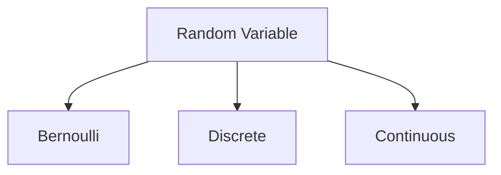

# Ch. 3: Random Variables and Probability Distributions

- [Ch. 3: Random Variables and Probability Distributions](#ch-3-random-variables-and-probability-distributions)
  - [Concept of a Random Variable](#concept-of-a-random-variable)
  - [Discrete Probability Distribution](#discrete-probability-distribution)
  - [Continuous Probability Distribution](#continuous-probability-distribution)

## Concept of a Random Variable



- Random variable: a function that associate a real number with each element in the sample space
  - Bernoulli random variable: a random variable for which 0 and 1 are chosen to describe the two possible values
  - Discrete random variable: a random variable with its set of possible outcome are countable
  - Continuous random variable: a random variable that can take on values on a continuous scale

## Discrete Probability Distribution

- Probability function/probability mass function/probability distribution: 
  - The set of ordered pairs $(x, f(x))$: probability function of the discrete random variable $X$
    - Notice the different between $x$ and $X$
  - For each possible outcome $x$,

    1. $f(x) \geq 0$
    2. $\sum_{x} f(x) = 1$
    3. $P(X=x) = f(x)$

- Example
  1. A shipment of 20 laptops contains 3 that are defective. If someone make a purchase of 2 random laptops, find the probability distributions for the number of defectives!
     - If $x$ are possible number of defective, then
       - $P(X = 0) = \frac{\binom{3}{0} \binom{17}{2}}{\binom{20}{2}} = \frac{68}{95}$
       - $P(X = 1) = \frac{\binom{3}{1} \binom{17}{1}}{\binom{20}{2}} = \frac{51}{190}$
       - $P(X = 0) = \frac{\binom{3}{2} \binom{17}{0}}{\binom{20}{2}} = \frac{3}{190}$
     - The probability distribution of $X$
       
       |$x$   | 0    | 1     | 2     |
       |:----:|:----:|:-----:|:-----:|
       |$f(x)$| $\frac{68}{95}$|$\frac{51}{190}$ | $\frac{3}{190}$ |

  2. If 50% of the car inventory of an agency is blue, find the probability distribution of the number of blue cars among the next 4 cars sold!
     - $f(x) = \frac{\binom{4}{x}}{2^{4}} = \frac{1}{16} \binom{4}{x}$, for $x$ = 0, 1, 2, $\cdots$, 4
- Cumulative distribution function ($F(x)$)

```math
F(x) = P(X \leq x) = \sum_{t<x} f(t), \hspace{1em} \text{for } -\infty < x < \infty
```

  - Example: $F(0) = f(0)$, $F(1) = f(0) + f(1)$, $F(2) = f(0) + f(1) + f(2)$, $\cdots$, $F(\infty) = 1$


## Continuous Probability Distribution


- [Probability density function (pdf)](https://en.wikipedia.org/wiki/Probability_density_function): a function ($f(x)$) for the continuous random variable $X$, defined over the set of real number, If
  1. $f(x) \geq 0$, for all $x \in R$
  2. $\int_{-\infty}^{\infty} f(x) dx = 1$
  3. $P(a < X < b) = \int_{a}^{b} f(x) dx$

- Cumulative distribution function $F(x)$ of a continuous random variable X with density function $f(x)$

```math
F(x) = P(X \leq x) = \int_{-\infty}^{\infty} f(t) dt, \hspace{1em} \text{for } -\infty < x < \infty
```

- Joint probability distribution of discrete random variable $X$ and $Y$
  1. $f(x, y) \geq 0$, for all $(x, y)$
  2. $\sum_{x}\sum_{y} f(x, y) = 1$
  3. $P(X = x, Y = y) = f(x, y)$

- Joint probability distribution of continuous random variable $X$ and $Y$
  1. $f(x, y) \geq 0$, for all $(x, y)$
  2. $\int_{-\infty}^{\infty}\int_{-\infty}^{\infty} f(x, y) dx dy = 1$
  3. $P[(X,Y) \in A] = \int\int_{A} f(x, y) dx dy$

- Marginal distribution of $X$ alone and of $Y$ alone are
  - For discrete case: $g(x) = \sum_{y} f(x, y)$ (*column totals*) and $h(y) = \sum_{x} f(x, y)$ (*row totals*)
  - For continuous case: $g(x) = \int_{-\infty}^{\infty} f(x, y) dy$ and $h(y) = \int_{-\infty}^{\infty} f(x, y) dx$

- Conditional distribution of the random variable $Y$, given $X = x$ is

```math
f(y|x) = \frac{f(x, y)}{g(x)}, \hspace{1em} \text{provided } g(x) > 0
```

- Statistically independence: if $f(y|x)$ does not depend on $x$, then
    
    $f(y|x) = h(y)$ and $f(x, y) = g(x) h(y)$

- 