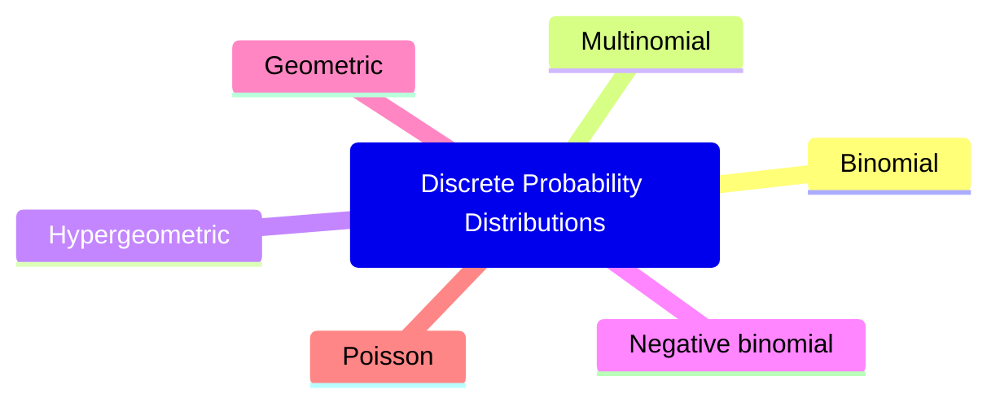

# Ch. 5: Some Discrete Probability Distribution



## Binomial and Multinomial Distributions

### Binomial Distributions

- Bernoulli process (process that results in one of two outcomes: success or failure)
  - The experiment consists of repeated trials
  - Each trial results in an outcome that may be classified as a success or failure
  - The probability of success ($p$) remains constants from trial to trial
  - The repeated trials are independent
- Binomial distributions
  - A Bernoulli trial can result in a sucess with probability $p$ and a failure with $q = 1 - p$
  - Then the probability distributions of the binomial random variable $X$, the number of successes in $n$ independent trials, is

```math
b(x; n, p) = \binom{n}{x} p^{x} q^{n-x}, \hspace{2em} x = 0, 1, 2, \cdots, n
```

- Binomial sum ($P (X < r)$)

```math
B(r; n, p) = \sum_{x=0}^{r} b(x; n, p)
```

- Example: A large chain retailer purchases a certain kind of electronic device from a manufacturer. The manufacturer indicates that the defective rate of the device is 3%. The inspector randomly picks 20 items from a shipment. What is the probability that there will be at least one defective item among these 20?

```math
P(X \geq 1) = 1 - P(X = 0) = 1 - b(0; 20, 0.03) = 0.4562
```

- Mean of the binomial distribution $b(x; n, p)$

```math
\mu = np
```

- Variance of the binomial distribution $b(x; n, p)$

```math
\sigma^2 = npq
```

### Multinomial distributions

- Multinomial distributions
  - If a given trial can result in the $k$ outcomes $E_1, E_2, \cdots, E_k$ with probabilities $p_1, p_2, \cdots, p_k$, then the probability distribution of the random variable $X_1, X_2, \cdots, X_k$, representing the number of the occurences in $n$ independent trials is

```math
f(x_1, x_2, \cdots, x_k; p_1, p_2, \cdots, p_k) = \binom{n}{x_1, x_2, \cdots, x_k} p_{1}^{x_{1}} p_{2}^{x_{2}} \cdots p_{k}^{x_{k}}
```

```math
\text{with } \sum_{i=1}^{k} x_{i} = n \text{ and } \sum_{i=1}^{k} p_{i} = 1
```


- Example: For a certain airport with three runaways, it is known that in the ideal setting the following are the probabilities that the individual runways are accessed by a randomly arriving commercial jet.
  - Runway 1: $p_1 = 2/9$
  - Runway 2: $p_2 = 1/6$
  - Runway 3: $p_3 = 11/18$

- What is the probability that 6 randomly arriving airplanes are distributed in the following manners.
  - Runway 1: 2 airplanes
  - Runway 2: 1 airplanes
  - Runway 3: 3 airplanes

```math
f \left( 2, 1, 3 ; \frac{2}{9} \frac{1}{6} \frac{11}{18} \right) = 0.1127
```

## Hypergeometric Distribution

- Hypergeometric distribution
  - Properties:
    - A random sample  of size $n$ is selected without replacement from $N$ items
    - Of the $N$ items, $k$ may be classified as successess and $N - k$ are classified as failures
  - Definition: The probability distribution of the hypergeometric random variable $X$, the number of successess in a random sample size of $n$ selected from $N$ items of which $k$ are labeled success and $N-k$ labeled as failure is

```math
h(x; N, n, k) = \frac{\binom{k}{x} \binom{N-k}{n-x}}{\binom{N}{n}}, \hspace{1em} \max \{0, n - (N-k)\} \leq x \leq \min \{n, k\}
```

- Example: Lots of 40 components each are deemed unnaceptable if they contain 3 or more defectives. The procedure for sampling a lot is to select 5 components at random and to reject the lot if a defective is found. What is the probability that exactly 1 defective is found in the sample if there are 3 defectives in the entire lot?

```math
h(1; 40, 5, 3) = 0.3011
```

- Mean of the hypergeometric distribution $h(x; N, n, k)$

```math
\mu = \frac{nk}{N}
```

- Variance of the hypergeometric distribution $h(x; N, n, k)$

```math
\sigma^2 = \frac{N-n}{N-1} \cdot n \cdot \frac{k}{N} \left( 1 - \frac{k}{N} \right)
```

- Relation to [binomial distribution](#binomial-distributions)
  - If $n$ is small compared to $N$, binomial distribution can be used to approximate hypergeometric distribution
  - A rule of thumb: this will apply if $n/N \leq 0.05$ 

- Multivariate hypergeometric distribution
  - If $N$ items can be partioned into $k$ cells $A_1, A_2, \cdots, A_k$ with $a_1, a_2, \cdots, a_k$ elements, respectively, then the probability distribution of the random variables $X_1, X_2, \cdots, X_k$, representing the number of elements selected from $A_1, A_2, \cdots, A_k$ in a random sample size of $n$ is

```math
f(x_1, x_2, \cdots, x_k; a_1, a_2, \cdots, a_k, N, n) = \frac{\binom{a_1}{x_1} \binom{a_2}{x_2} \cdots \binom{a_k}{x_k}}{ \binom{N}{n}}
```

```math
\text{with } \sum_{i=1}^{k} x_i = n \text{ and } \sum_{i=1}^{k} a_i = N
```

- - Example: A group of 10 individuals is used for a biological case study. The group contains 3 people with blood type O, 4 with blood type A, and 3 with blood type B. What is the probability that a random sample of 5 will contain 1 person with blood type O, 2 people with blood type A, and 2 people with blood type B?

```math
f(1, 2, 2; 3, 4, 3, 10, 5) = \frac{3}{14}
```